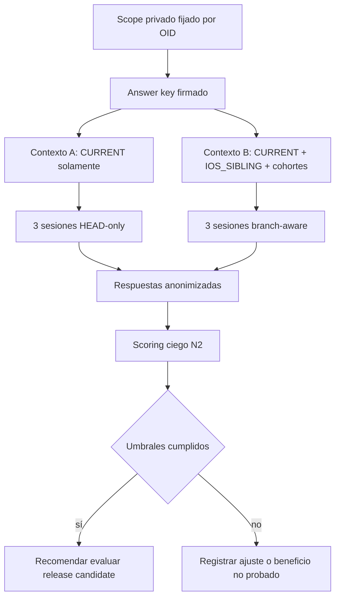

# Handoff — Branch-aware operational pilot

Fecha: 2026-09-23 · **Plan v1** · Estado: pendiente de aprobación humana.

## 1. Resultado buscado

Medir si branch-aware discovery produce una respuesta más completa y correctamente
atribuida que HEAD-only para una tarea real, manteniendo igual presupuesto y configuración
IA. El piloto informa evidencia; no modifica código ni autoriza una release.

## 2. Tarea recomendada

Producir un plan de cambio sin implementación para migrar las notificaciones push de
`IOS_SIBLING` a la generación de API observada en `CURRENT`.

La respuesta debe identificar:

- archivos y diferencias relevantes;
- incompatibilidades entre APIs/versiones;
- orden de migración;
- configuración o valores propios del target que no deben copiarse;
- validaciones necesarias;
- rollback;
- límites que requieren dispositivo, backend o confirmación humana.

El snapshot de planificación encontró 51 rutas distintas entre ambos targets; cuatro de
los cinco paths acotados difieren. Entre 82 tips existen tres cohortes: 55 `setAppId`,
10 `startInit` y 17 `initialize`. Esto es evidencia estática, no estado productivo.

## 3. Scope y privacidad

Los aliases, refs y OID exactos están en:

```text
.git/private-evidence/branch-aware-operational-pilot/PRIVATE_SCOPE.json
```

Ese archivo y el inventario privado no deben agregarse a Git ni copiarse al prompt.
Las respuestas solo usan aliases y OID abreviados cuando haga falta. Antes de ejecutar,
refrescar el inventario: si los OID cambiaron, detenerse y preparar plan v2; no reemplazar
silenciosamente el scope aprobado.

El output se crea en un directorio externo elegido con `mktemp -d` o una ruta privada
explícita. Registrar la ruta exacta; nunca escribir en el worktree o `.git` del piloto.

## 4. Prompt congelado

El siguiente cuerpo es idéntico para A y B; luego se anexa el paquete de evidencia de
cada modo. Guardar su SHA-256 antes de la primera corrida.

```text
TAREA

Prepará un plan de cambio sin editar código para migrar las notificaciones push de
IOS_SIBLING a la API moderna observada en CURRENT.

Usá únicamente la evidencia adjunta. No supongas que una rama está activa ni que el
backend, App ID, permisos o entrega de notificaciones fueron verificados.

Entregá:

1. diagnóstico por target;
2. archivos afectados y evidencia alias@OID:ruta;
3. incompatibilidades de dependencia/API;
4. pasos mínimos ordenados;
5. valores o comportamiento que deben preservarse;
6. pruebas necesarias;
7. rollback;
8. hechos, inferencias y unknowns separados.

No escribas código. No atribuyas contenido de un target al otro. Si falta evidencia,
respondé unknown y explicá exactamente qué falta.
```

## 5. Diseño experimental



Presupuesto máximo: 131072 bytes por corrida. El paquete A contiene los cinco paths de
`CURRENT`. B reparte el mismo límite entre ambos targets, deltas y resumen de cohortes.
Ambos paquetes incluyen el mismo prompt, formato y rubric.

## 6. Fases de ejecución

### P0 — Confirmar plan y scope

- Registrar aprobación humana de plan v1 y autorización de ejecución.
- Leer `PRIVATE_SCOPE.json`; comprobar que existe y no está staged.
- Crear output externo y manifest de archivos.

No requiere inferencia IA: son comprobaciones deterministas.

### P1 — Preflight de integridad

- Capturar HEAD/ref/OID, hashes de refs, status, diffs, índice y untracked.
- Ejecutar `inspect` con output externo.
- Exigir cobertura completa y `check` donde corresponda.
- Comparar OID actuales con plan v1; detener ante drift.

Comandos base, con variables leídas del scope privado:

```bash
analysis_dir="$(mktemp -d /tmp/quiver-operational-pilot.XXXXXX)"
bash scripts/discover-variants.sh inspect \
  --repo "$pilot_repo" \
  --output "$analysis_dir/inventory"

bash scripts/discover-variants.sh compare \
  --repo "$pilot_repo" \
  --left "$current_ref" \
  --right "$sibling_ref" \
  --output "$analysis_dir/current-vs-sibling.json"
```

No interpolar refs en una shell construida dinámicamente; cada argumento debe permanecer
separado.

### P2 — Answer key y contextos

- Generar answer key antes de respuestas y firmarlo con SHA-256.
- Crear tarea JSON con los cinco paths y `max_bytes` acorde al reparto.
- Generar manifest para cada target mediante `context` y validarlo con `check`.
- Construir A/B bajo el mismo límite total; contar bytes, archivos, fragmentos y blobs.
- Guardar mapa A/B separado del scorer.

### P3 — Seis respuestas independientes

- Ejecutar pares `AB`, `BA`, `AB` en seis sesiones nuevas.
- Solicitar BALANCED — **GPT-5.6 Terra (`gpt-5.6-terra`) / Medium**.
- Fallback: **GPT-5.6 Sol (`gpt-5.6-sol`) / Medium**, aplicado a ambos lados del par.
- Registrar configuración efectiva solo si `/status` o el runtime la muestran.
- No compartir respuestas, summaries ni memoria entre sesiones.

Mecanismo preferido, verificado contra `codex-cli 0.155.1`: crear seis directorios
aislados que contengan solo `PROMPT.txt` y el paquete A o B, y ejecutar cada respuesta
como proceso efímero:

```bash
codex exec --ephemeral --skip-git-repo-check --ignore-user-config \
  --model gpt-5.6-terra \
  --config 'model_reasoning_effort="medium"' \
  --sandbox read-only \
  --cd "$isolated_run_dir" \
  --json \
  --output-last-message "$response_file" \
  - < "$prompt_and_evidence_file" > "$events_file"
```

Revisar `events_file`: una llamada de herramienta invalida esa corrida, porque las
respuestas deben usar únicamente la evidencia adjunta. Si el modelo no está disponible,
repetir **ambos lados del par** con el fallback. Si `codex exec --ephemeral` o el sandbox
read-only no están disponibles al ejecutar, registrar `unavailable-runtime-capability` y
detenerse; no simular sesiones independientes dentro del mismo chat.

### P4 — Scoring ciego

- Renombrar respuestas sin revelar modo.
- Puntuar recall, precisión, omisiones y atribución contra el answer key firmado.
- Abrir el mapa solo después de cerrar scoring.
- Calcular medianas/rangos de métricas observables y conservar `unknown` donde aplique.
- El scorer puede inferir el modo por el contenido: el cegado evita conocer el mapa, pero
  no se presenta como doble ciego ni como eliminación total de sesgo.

### P5 — Review N2

- Review dedicado con **GPT-5.6 Sol (`gpt-5.6-sol`) / High**.
- Fallback: **GPT-5.6 Terra (`gpt-5.6-terra`) / High o XHigh**.
- Verificar integridad, aislamiento, rubric, cálculos, límites y conclusión.
- Corregir como máximo una ronda dirigida; no reescribir outputs evaluados.

### P6 — Cierre

- Emitir `BENCHMARK_REPORT.md` sanitizado y evidencia privada separada.
- Resultado posible: `release candidate`, `ajustar`, `beneficio no probado`.
- Actualizar STATE/PROJECT_STATE.
- Detenerse ante la decisión humana de release; no hacer commit/push/release.

## 7. Matriz de trazabilidad

| AC | Fase | Evidencia |
|---|---|---|
| AC1, AC3, AC4 | P2 | hashes de prompt, manifests A/B, tamaño serializado |
| AC2, AC11 | P1/P6 | snapshots before/after y comparación exacta |
| AC5 | P3 | seis IDs de sesión/corrida y orden predefinido |
| AC6 | P2/P4 | hash del answer key y timestamps anteriores a respuestas |
| AC7, AC8 | P4/P5 | scoring por corrida y review N2 |
| AC9, AC10 | P2–P4 | measurements JSON con valores/unknowns separados |
| AC12 | P5/P6 | veredicto de review y reporte final |

## 8. Riesgos y controles

| Riesgo | Control |
|---|---|
| Contaminación A/B | Sesiones nuevas, orden alternado y outputs separados. |
| Scorer sesgado | Labels ciegos y answer key firmado previamente. |
| Ref movida | OID fijado, `check`, recaptura de refs y stop inmediato. |
| Fuga de identidad/código | Aliases públicos, evidencia privada, revisión del contexto antes de cada sesión. |
| Claim de runtime falso | Lista explícita de unknowns y penalización de severidad alta. |
| Comparación injusta | Mismo prompt, modelo/reasoning por par, rubric y límite de bytes. |
| Costo excesivo | Scope de cinco paths y seis respuestas; sin builds ni contexto completo. |
| Optimización aparente | Bytes, tokens, tiempo y calidad se reportan como métricas distintas. |

## 9. Rollback

No hay cambios funcionales. Ante incidente:

1. detener la corrida;
2. conservar hashes/evidencia del incidente;
3. verificar integridad del piloto;
4. eliminar solo el `analysis_dir` exacto cuando ya no sea necesario;
5. no usar `git clean`, reset, checkout, stash o globs destructivos.

## 10. Model routing

- Planning solicitado: ADVANCED — **GPT-5.6 Sol (`gpt-5.6-sol`) / High**.
  Effective session config: `unknown`; no se infiere.
- P0–P2: comandos deterministas; no requieren llamada de modelo.
- P3: BALANCED — **GPT-5.6 Terra (`gpt-5.6-terra`) / Medium**.
  Switch Benefit: MEDIUM; no requiere gate solo por preferencia.
- P4: scoring determinista contra rubric; no requiere modelo antes del review.
- P5: ADVANCED — **GPT-5.6 Sol (`gpt-5.6-sol`) / High**.
  Switch Benefit: HIGH por review N2 de privacidad/atribución; confirmar con `/status`
  y `/model` antes del review si la configuración suficiente no está verificada.
- GPT-6 Astra no está justificado.

## 11. Límite de validez

La tarea fue elegida porque HEAD no contiene la evidencia del sibling: es un test directo
del problema de alcance que resuelve branch-aware discovery. No demuestra que B mejore
tareas resolubles enteramente en HEAD, no mide calidad general del modelo y no prueba
ahorro de tokens. El informe debe limitar su conclusión a tareas que requieren evidencia
de otra variante bajo condiciones comparables.

## 12. Boundary actual

Plan v1 listo y autorrevisado. Falta aprobación humana del plan y autorización de
ejecución. No comenzar P0–P6 hasta recibir ambas.
